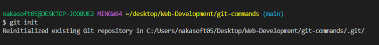
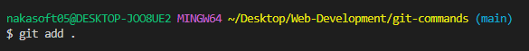
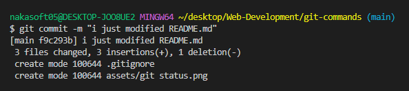
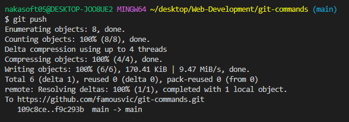

# git-commands
The repo contains the command for working with git

1. `git init` - *This command is used to intialize a git repository*
>

2. `git status`- *This command displays the state of the working directory and the staging area. Shows which changes have been staged, which haven’t, and files that aren’t being tracked by Git.*
>

3. `git add`- *command is used to add changes in the working directory to the staging area. It tells Git that you want to include updates to a particular file or files in the next commit.*
>

4. `git commit`- *command is used to save your changes to the local repository.*
>

5. `git push`- *The command is used to upload local repository content to a remote repository. When you execute git push, you are transferring commits from your local repository to a remote repository.*
>